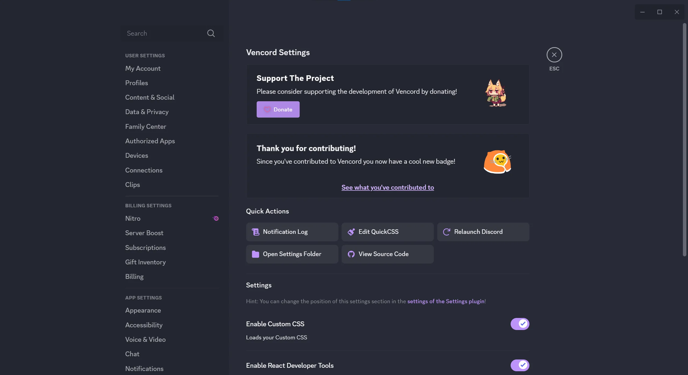

# ₊˚ discord-dracula ˚₊

cute dracula theme for discord~

partially restores the old layout prior to the *visual refresh*


<details>
<summary><b>Additional Screenshots</b></summary>
<br/>

<br/><br/>

<br/><br/>

</details>

## ♡ installation

Add the following snippet **to the top** of your custom css, and **enable dark mode**:

```css
@import url("https://rushiiMachine.github.io/discord-dracula/main.css");
```

Alternatively, you can download [`dracula.theme.css`] and add it to your
client mod's `themes` folder! (right-click > *Save As*)

If using Vencord, it is recommended to enable the `PlainFolderIcon` plugin in order
to always display the folder icons shown in the screenshots!

---

If you like what you see, please consider [sponsoring me] on GitHub!

## ♡ credits

This theme is inspired by an outdated theme created by fawn: [`fawni/dracula`]!\
Visual Refresh revert for guilds list from [`scattagain/VencordStuff`].\
Other Visual Refresh reverts from [`MaiRiosIPla/unshittify-discord`].

## ♡ developing

If you want to contribute, install [Node.js] 22+, and run the following commands:

```shell
$ git clone https://github.com/rushiiMachine/discord-dracula
$ cd discord-dracula
$ npm install --global corepack
$ corepack install
$ pnpm install
# Configure .env
$ pnpm watch
```

Before running the final command, copy the `.env.example` file to `.env`, and populate
the `THEME_DIR` variable with a path to your client mod's `themes` directory.
This is to allow for hot-reloading the compiled theme.
After running `pnpm watch`, any changes inside the `src` directory will cause the
theme to be recompiled and reapplied.

[//]: # (@formatter:off)

[`dracula.theme.css`]: https://github.com/rushiiMachine/discord-dracula/blob/master/dracula.theme.css
[sponsoring me]: https://github.com/sponsors/rushiiMachine
[`fawni/dracula`]: https://github.com/fawni/dracula
[`scattagain/VencordStuff`]: https://github.com/scattagain/VencordStuff
[`MaiRiosIPla/unshittify-discord`]: https://github.com/MaiRiosIPla/unshittify-discord
[Node.js]: https://nodejs.org/en

[//]: # (@formatter:on)

